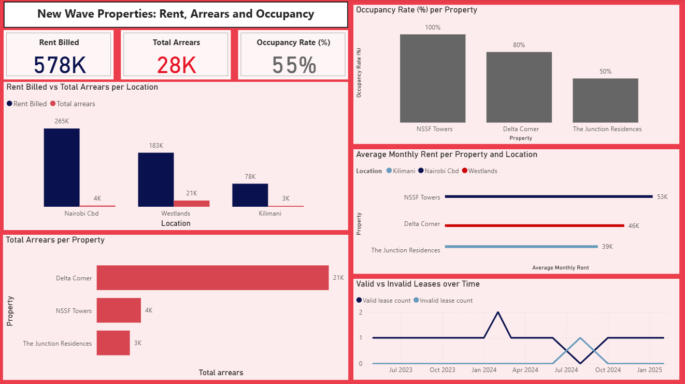

# Property-Performance-Analysis

## Introduction

The goal of this analysis is to evaluate rental performance, occupancy trends, and arrears to support data-driven property management decisions.

## Data overview

The analysis uses five datasets/tables:
- **Locations:** lists the various locations where the company’s properties are located.
- **Properties:** contains the name of each property.
- **Units:** provides information on individual rental units available from the properties.
- **Tenants:** includes records of tenants renting various units.
- **Leases:** contains lease agreements, including start and end dates, rent amounts, and payment status.

## Data Quality Issues

**Locations, Properties, Units:** Clean datasets - no missing or duplicate values, appropriate data types, and valid numeric ranges.

**Tenants:** One missing email entry, possibly incomplete contact information.

**Leases:**

- Incorrect date formats in start_date and end_date.

- Missing end_date values - possibly ongoing leases or incomplete entries.

- Negative values in rent_per_month and arrears - potential data entry or system errors, or overpayment in the case of arrears.

- end_date earlier than start_date in some records - flagged as invalid leases.

## Data Cleaning and Transformation

- Converted date fields to proper datetime format.

- Replaced missing end_date values with the current date for ongoing leases.

- Corrected negative rent values using absolute values.

- Standardized location names to proper case for consistency.

- Created new columns:

`lease_duration_months` — duration between start_date and end_date.

`lease_status` — categorized as ongoing, expired, or invalid.

`valid_lease` — 0 or 1.

`annual_rent` — computed as monthly rent × 12.

- Exported cleaned datasets for analysis.

> For detailed cleaning and transformation steps, see notebook: [Notebook](https://github.com/MaureenMbugua/Property-Performance-Analysis/blob/main/Property_Performance_Analysis.ipynb)

## Analysis

### SQL Queries

The project includes SQL-based analysis to explore key performance metrics such as rent billed, arrears, and occupancy across locations and properties.

> For the full SQL queries, refer to the query file: [SQL Queries](https://github.com/MaureenMbugua/Property-Performance-Analysis/blob/main/SQL_Queries_Property_Performance.sql)

### Dashboard

A Power BI dashboard was also developed to visually summarize key insights on rent performance, arrears, and occupancy across locations and properties. See an image of the dashboard below:

> To interact with the actual dashboard, refer to the Power BI dashboard file: [Dashboard](https://github.com/MaureenMbugua/Property-Performance-Analysis/blob/main/Dashboard_Property_Performance.pbix)

## Insights and Recommendations

The following are the key insights derived, highlighting both strengths and areas requiring intervention.

### a) NSSF Towers in Nairobi – Top Performing Property

NSSF Towers in Nairobi CBD is the best performing property, with the highest rent billed (265K), likely contributed to by leading in average monthly rent (53K), occupancy (100%), and collection efficiency (98%). These reflect both strong demand and effective management.

**Recommendation:**
- Use NSSF Towers as a benchmark for best practices in tenant retention and rent collection.
- The Nairobi CBD also seems like a prime location and should be explored for future
investment opportunities.

### b) Low Occupancy at the Junction Residences in Kilimani

The Junction Residences in Kilimani is a point of concern given its low occupancy (50%) which likely contributes to its weak rent performance. Given that it also records the lowest average rent, issues with tenant uptake or retention point to either property issues or an unfavourable market in Kilimani.

Additionally, Riverside Court and Kimathi House currently report 0% occupancy.

**Recommendation:**
- Focus on first understanding the low occupancy at The Junction Residences to find a
fitting resolution - This could involve reviewing its pricing, competitiveness, marketing approach, and leasing management, etc.
- If the market in Kilimani allows it, these challenges can likely be fixed through
repositioning or targeted marketing.
- Otherwise, management may need to reconsider future investments in the area.
-Zero-occupancy properties in CBD and Westlands need urgent action to realize their
revenue potential, given that other properties in those areas are performing well.

### c) Collection Efficiency Gaps in Delta Corner, Westlands

All properties record some arrears, but Delta Corner in Westland stands out with the highest arrears(21K) and lowest collection efficiency (77%). This suggests weak rent collection or delayed tenant payments.

**Recommendations:**
- Review Delta Corner to pinpoint the cause - ineffective rent follow-up, lease
management gaps, or problematic tenants, etc.
-Management should consider streamlining rent collection procedures, implementing
structured arrears follow-up cadences, and better tenant screening.

### d) Data Quality and Lease Integrity Issues

A few leases were flagged as invalid due to data inconsistencies, such as negative rent values and end dates preceding start dates. These likely come from data entry or system errors. This can distort analysis and billing operations if unchecked.

**Recommendation:**
- Conduct a lease data audit to identify and correct invalid entries, ensuring that billing, arrears, and occupancy calculations reflect accurate information.
- Implement data validation checks at the point of entry, as well as periodic data quality reviews.

## Next Steps
- Predictive analytics using Python
